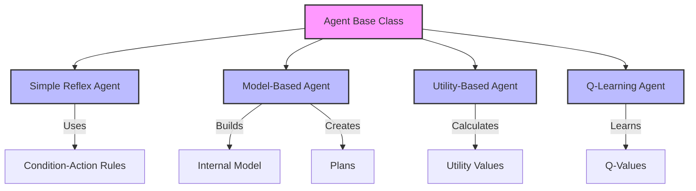
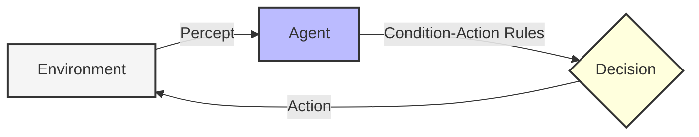
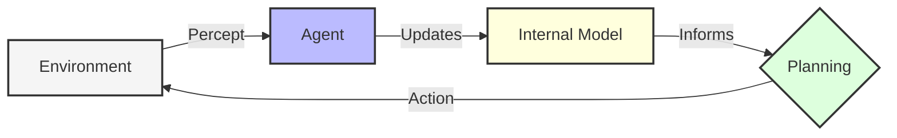
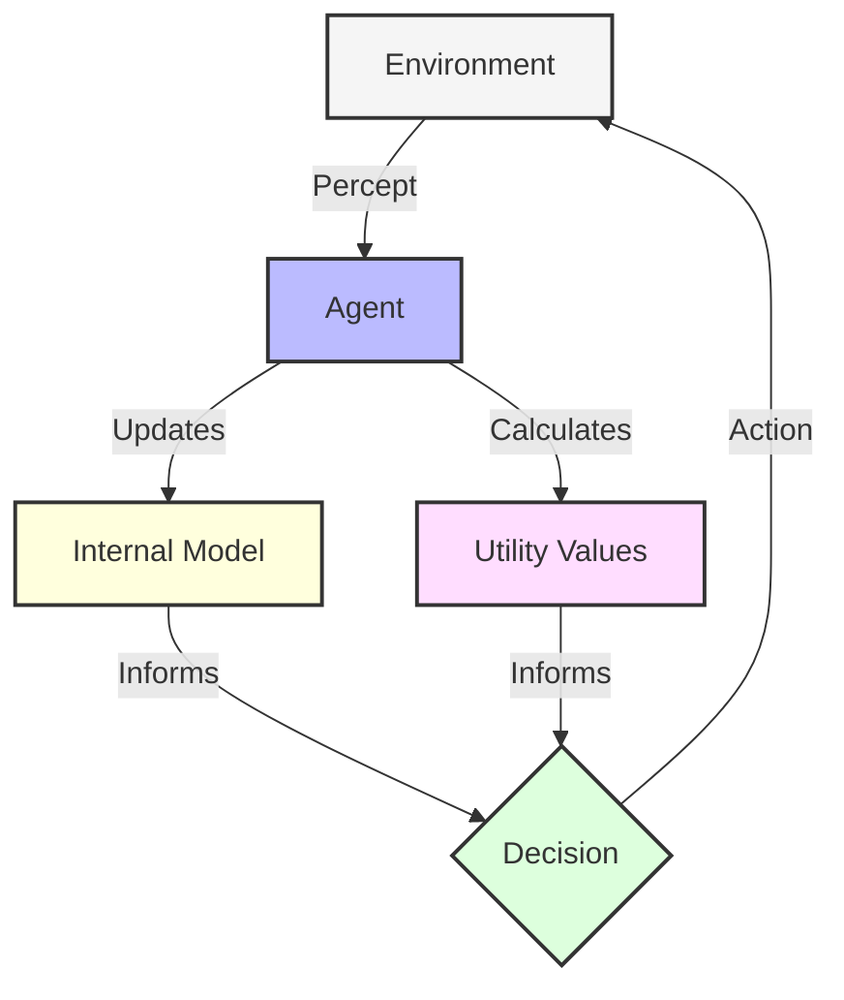
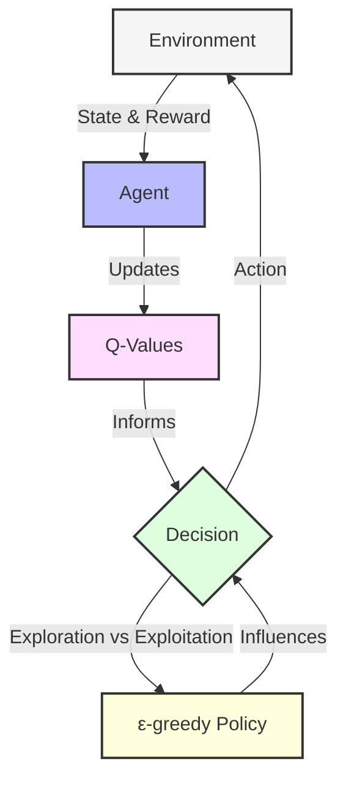

# AI Agent Simulation

**Reinforcement Learning Visualizer** — an interactive web app that demonstrates four classic AI agent architectures navigating a procedurally generated grid world.


> All simulation logic runs fully client-side in TypeScript — no server required. Deploy to Vercel with zero configuration.

## Table of Contents

- [Overview](#overview)
- [Agent Types](#agent-types)
- [Tech Stack](#tech-stack)
- [Getting Started](#getting-started)
- [Project Structure](#project-structure)
- [Deployment (Vercel)](#deployment-vercel)
- [Background Theory](#background-theory)
- [Contributing](#contributing)
- [License](#license)

## Overview

An interactive web app that runs entirely in the browser. Select an agent, initialize a maze, then step or auto-run to watch the agent navigate. Switch between **Normal**, **Heatmap**, and **Value** visualization modes to inspect learning progress.

**Key features:**
- Four agent types — Reflex, Model-Based, Utility, Q-Learning
- Procedurally generated 15×8 maze with guaranteed solvable path
- Real-time performance chart (Recharts)
- Visit heatmap, value map visualization modes
- Simulation log with per-step events
- Agent comparison table
- Fully responsive dark UI (Tailwind CSS)
- Zero-config Vercel deployment

## 🤖 Agent Types

The project implements four classic agent types with increasing levels of sophistication:



### 1. Simple Reflex Agent

Simple reflex agents select actions based only on the current percept, ignoring history. They map directly from current observations to actions using condition-action rules.



**Key Characteristics:**
- No memory of past observations
- Relies on direct mapping from percepts to actions
- Uses condition-action rules (if-then statements)
- Simple to implement but limited capabilities
- Cannot learn from experience

**Implementation Details:**
- Rules are defined using condition-action pairs
- Conditions are functions that evaluate percepts
- Actions are either direct responses or functions that process percepts
- Best for simple, fully observable environments

### 2. Model-Based Agent

Model-based agents maintain an internal representation of the world, tracking how the environment evolves. This allows them to plan paths and make better decisions by predicting future states.



**Key Characteristics:**
- Maintains memory of the environment
- Creates an internal map of the world
- Can plan paths to goals
- Makes decisions based on predicted outcomes
- More sophisticated than reflex agents

**Implementation Details:**
- Uses a dictionary to map positions to cell contents
- Implements A* search algorithm for path planning
- Updates model with new percepts
- Falls back to exploration when planning is not possible

### 3. Utility-Based Agent

Utility-based agents choose actions based on a utility function that measures the desirability of different states. They evaluate how good each possible outcome would be and choose actions to maximize expected utility.



**Key Characteristics:**
- Evaluates different outcomes based on desirability
- Balances between exploration and exploitation
- Makes decisions that maximize expected value
- Can adapt to changing environments
- More flexible than model-based agents

**Implementation Details:**
- Implements value iteration for utility calculations
- Uses discount factor to balance immediate vs. future rewards
- Has configurable exploration rate for trying new paths
- Updates utilities after each move

### 4. Q-Learning Agent

Q-learning agents use reinforcement learning to improve their behavior through experience. They learn optimal action values (Q-values) for state-action pairs over time through trial and error.



**Key Characteristics:**
- Learns optimal behaviors through trial and error
- Updates Q-values based on received rewards
- Balances exploration and exploitation
- Improves over time without explicit programming
- Can discover optimal policies in complex environments

**Implementation Details:**
- Implements Q-learning update formula
- Uses epsilon-greedy policy for action selection
- Features decay of exploration rate over time
- Provides reward structure: -0.1 per step, -5.0 for hitting obstacles, +20.0 for reaching goals
- Tracks visit counts for visualization

## Tech Stack

| Layer | Technology |
|-------|-----------|
| Framework | Next.js 14 (App Router) |
| Language | TypeScript 5 |
| Styling | Tailwind CSS 3 |
| Charts | Recharts 2 |
| Icons | Lucide React |
| Deployment | Vercel |

All agent logic (A*, Value Iteration, Q-Learning) runs **in the browser** as TypeScript — no backend, no API routes.

## Getting Started

```bash
# 1. Clone
git clone https://github.com/yourusername/agent_implementation.git
cd agent_implementation

# 2. Install
npm install

# 3. Dev server
npm run dev
```

Open [http://localhost:3000](http://localhost:3000).

## Project Structure

```
agent_implementation/
├── src/
│   ├── app/
│   │   ├── layout.tsx          # Root layout (fonts, metadata, favicon)
│   │   ├── page.tsx            # Entry page
│   │   ├── SimulationApp.tsx   # Main client component (all UI)
│   │   └── globals.css         # Tailwind + custom CSS variables
│   └── lib/
│       └── simulation.ts       # All agent logic (TS port of Python agents)
├── public/
│   └── favicon.svg             # Neural-network SVG favicon
├── package.json
├── next.config.js
├── tailwind.config.js
└── tsconfig.json
```

### Core module — `src/lib/simulation.ts`

Contains the complete TypeScript implementation of:

| Class | Algorithm |
|-------|-----------|
| `ReflexAgent` | Condition-action rules |
| `ModelAgent` | A* pathfinding with internal world model |
| `UtilityAgent` | Value iteration (Bellman equation, ε-greedy) |
| `QLearningAgent` | Q-learning (TD update, exploration decay) |
| `SimulationEngine` | Grid world, maze generation, perceive-decide-act loop |

## Deployment (Vercel)

```bash
# Option A — Vercel CLI
npx vercel

# Option B — push to GitHub and import repo at vercel.com
# No environment variables needed — zero config
```

Build command: `npm run build`
Output directory: `.next`

## 📊 Agent Performance Comparison

The interface includes a comparison view where you can see metrics for all agent types side by side:

### Comparison Metrics:

| Agent Type | Steps to Goal (Avg) | Success Rate (%) | Learning | Planning | Memory | Adaptability |
|------------|:-------------------:|:----------------:|:--------:|:--------:|:------:|:------------:|
| Simple Reflex | 28 | 70 | ❌ | ❌ | ❌ | ❌ |
| Model-Based | 16 | 90 | ❌ | ✅ | ✅ | ⚠️ |
| Utility-Based | 19 | 85 | ⚠️ | ✅ | ✅ | ✅ |
| Q-Learning | 22 | 95 | ✅ | ⚠️ | ✅ | ✅ |

**Legend**: ✅ = Yes, ⚠️ = Partial, ❌ = No

### Performance Analysis:

- **Simple Reflex Agent**: Fastest implementation but poorest performance. May get stuck in loops or fail to find the goal in complex environments.
- **Model-Based Agent**: Excellent performance once it has mapped the environment. Most efficient in steps-to-goal but requires time to build its model.
- **Utility-Based Agent**: Good balance of exploration and exploitation. Adapts well to changing environments.
- **Q-Learning Agent**: Highest success rate over time as it learns optimal policies. Initial performance may be lower than model-based agents.

## 🧠 Background Theory

The agents implemented in this project are based on fundamental AI concepts from Russell and Norvig's "Artificial Intelligence: A Modern Approach":

### Agent Types in AI Theory

1. **Simple Reflex Agents**:
   - Based on the condition-action rule paradigm
   - Only use current percept, not history
   - Simplest form of intelligent agent
   - Theoretical foundation: Basic stimulus-response models

2. **Model-Based Agents**:
   - Maintain internal state to track aspects of the world
   - Use state information to handle partial observability
   - Theoretical foundation: State-space search algorithms (like A*)

3. **Utility-Based Agents**:
   - Assign a utility (desirability) to states
   - Choose actions based on maximizing expected utility
   - Theoretical foundation: Decision theory, utility theory

4. **Reinforcement Learning Agents**:
   - Learn from interaction with the environment
   - Use trial and error to discover optimal policies
   - Theoretical foundation: Q-learning, temporal difference learning

### Key Algorithms

#### A* Search (Model-Based Agent)
A best-first search algorithm that uses:
- g(n): Cost from start to current node
- h(n): Heuristic estimate of cost from current node to goal
- f(n) = g(n) + h(n): Estimated total cost

#### Value Iteration (Utility-Based Agent)
An algorithm to compute optimal utilities based on:
- Bellman equation: U(s) = R(s) + γ * max_a ∑ P(s'|s,a) * U(s')
- Discount factor (γ): Balance between immediate and future rewards
- Convergence occurs when utility values stabilize

#### Q-Learning (Q-Learning Agent)
A reinforcement learning algorithm:
- Q(s,a) = Q(s,a) + α * [R + γ * max_a' Q(s',a') - Q(s,a)]
- Learning rate (α): How quickly new information overrides old
- Discount factor (γ): Value of future vs. immediate rewards
- Exploration rate (ε): Probability of trying random actions

## Extending

### Add a new agent type

In `src/lib/simulation.ts`, create a class that extends `Agent`, implement `perceive()`, `decide()`, `getInfo()`, and `getVisitCounts()`, then add it to the `SimulationEngine` constructor switch and to `AGENT_META` in `SimulationApp.tsx`.

### Adjust maze size

Change `width` / `height` defaults in the `SimulationEngine` constructor.

## Contributing

1. Fork the repo
2. Create a feature branch (`git checkout -b feature/my-feature`)
3. Commit (`git commit -m 'Add my feature'`)
4. Push and open a PR

## 📄 License

This project is licensed under the MIT License - see the LICENSE file for details.

The MIT License grants permission to use, copy, modify, merge, publish, distribute, sublicense, and/or sell copies of the software, as long as the copyright notice and permission notice are included in all copies or substantial portions of the software.